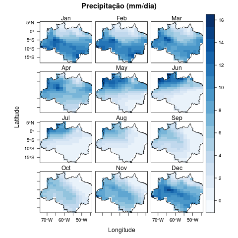
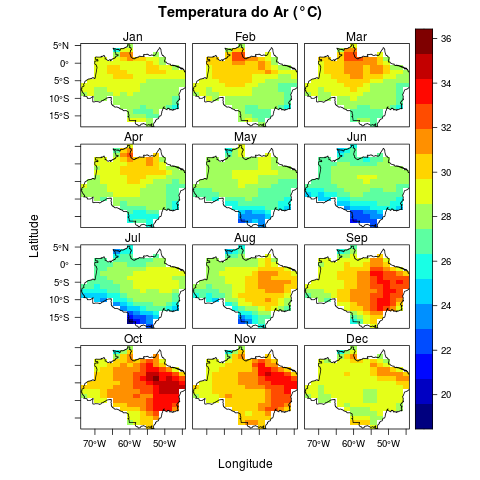

**DESCRIPTION**

Simple script in R to plot atmospheric conditions (Surface temperature and precipitation) over the Amazon forest, both in its present state and under a future global warming scenario.

The atmospheric data are from outputs of HadGEM2-ES CMIP5 experiments, and were downloaded from http://archive.ceda.ac.uk/, in NetCDF format.

To crop the atmospheric data, a shapefile delimiting the Amazon region was used, downloaded from http://terrabrasilis.dpi.inpe.br/.

**OUTPUT EXAMPLES**

The images below represent the average monthly distribution of precipitation and surface air temperature over the Amazon, for the years 2041 to 2070, under the RCP8.5 global warming scenario. 

  
   	
</p

